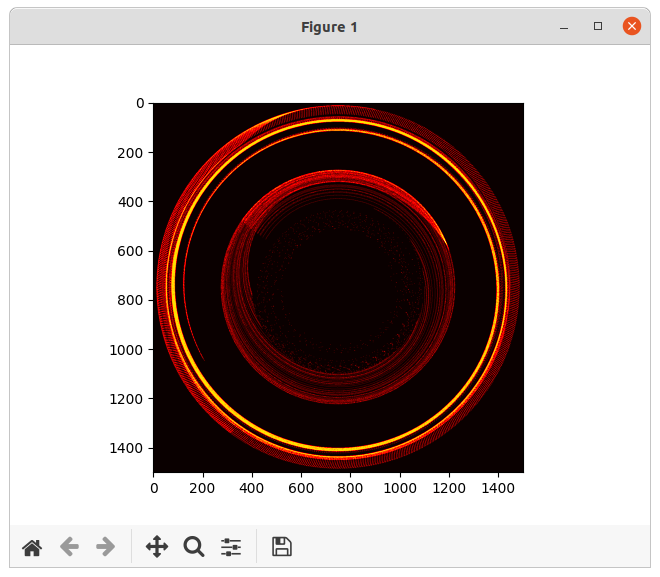

# Blackhole 2d 
A toy simulation of a ~kinda~ 2d blackhole


Nice TODO
-----
* Add relativistic effects (currently using newtonian physics :/)

Usage
-----

```
 pip3 install numpy matplotlib tqdm
 # then...
 ./to_image.py   

 # obs: set flag RE_CALCULATE=True inside <to_image.py> for new images every time
```

Implementation
-----
Check https://www.asc.ohio-state.edu/orban.14/stemcoding/blackhole_derivation_slide3.png for more information
